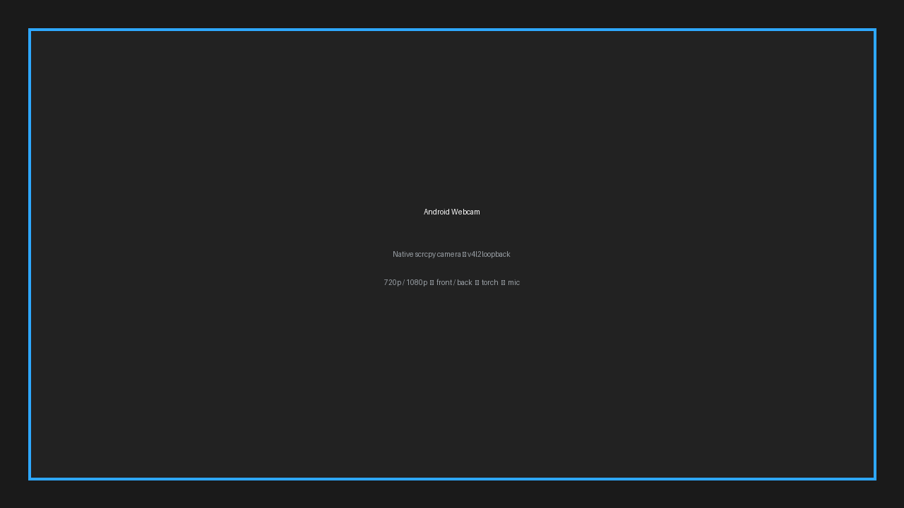

# Android Webcam — Native scrcpy Camera → v4l2loopback

Replace Iriun with a zero-dependency native webcam using `scrcpy --video-source=camera --v4l2-sink=/dev/video0` (requires Android 12+, `scrcpy 4.1`). One click in Hyprland/Omarchy, GUI for camera/resolution/audio/torch, no proprietary APK.



## Why

- **Native:** `scrcpy-server.jar` streams `H264` over `adb TCP 5555` → host decodes → `v4l2loopback`. No `iriunwebcam` daemon, no phone APK beyond `scrcpy`.
- **Root-optional:** camera works via `adb shell`; with root (`Termux: tsu`) you get persistent `5555` at boot (`/data/adb/service.d/adb_tcp.sh`) + lowest brightness `1/0.001` + screen-off keep-alive.
- **Validated:** Redmi Note 8 Pro `Android 16` `192.168.1.12:5555` — back `4640x3472`, front `2592x1940` @ `1280x720` / `1920x1080` `/30fps` captured as `22-63K` JPEGs via `ffmpeg -f v4l2 -i /dev/video0`.

## Install

Arch/Omarchy:
```bash
sudo pacman -S scrcpy android-tools v4l2loopback-dkms linux-headers ffmpeg
# group + module (one reboot after headers)
sudo usermod -aG video,adbusers $USER
echo "v4l2loopback" | sudo tee /etc/modules-load.d/v4l2loopback.conf
echo 'options v4l2loopback card_label="Android Webcam" exclusive_caps=1 video_nr=0' | sudo tee /etc/modprobe.d/v4l2loopback.conf
./scripts/install.sh
```

Launch:
```bash
android-webcam            # GUI (GTK4 + Adw)
android-webcam --back --1080 --no-window --v4l2-sink /dev/video0  # CLI
android-webcam --front --720 --torch --with-audio
```

Omarchy:
```bash
omarchy plugin add https://github.com/ishanp/android-webcam.git  # bar-widget + panel
omarchy plugin enable ishanp.android-webcam
# Hyprland: SUPER+SHIFT+W (webcam), SUPER+SHIFT+A (screen) — see omarchy-plugin/
```

## Removal

```bash
omarchy plugin remove ishanp.android-webcam
./scripts/uninstall.sh  # removes ~/.local/bin/android-webcam, desktop, hypr binds
sudo rm /etc/modules-load.d/v4l2loopback.conf /etc/modprobe.d/v4l2loopback.conf
```

## Options

- Camera: `back (id 0, 4640x3472, zoom 1-10)` / `front (id 1, 2592x1940, zoom 1-4)`
- Resolution: `720p (1280x720)` / `1080p (1920x1080)` + custom `WxH`
- FPS: `15/30` ( `120` high-speed at `1280x720`/`1920x1080`)
- Torch: `on/off` (back only, `MOD+Shift+t` in preview)
- Audio: `--with-audio --audio-source=mic` → Pulse `scrcpy` source (⚠️ echo if speakers → phone mic, keep off by default)
- Preview: `--with-preview` / `--no-window`

## License

MIT — see `LICENSE`. Depends on `scrcpy (GPLv2)`, `ffmpeg (LGPL/GPL)`, `v4l2loopback (GPLv2)`, `GTK4`/`libadwaita (LGPL)`.
